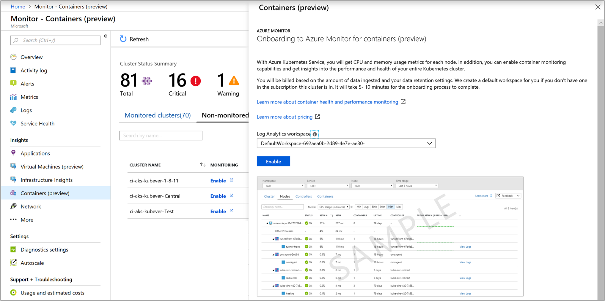

# Lab: Working with Azure Log Analytics

This lab walks through the process of setting up Azure Monitor for containers to monitor the performance of workloads that are deployed to Kubernetes environments and hosted on Azure Kubernetes Service.

## Prerequisites

* Complete previous labs for setting up [AKS](../../create-aks-cluster/README.md).

## Instructions

> **Note:** Because we used the `--enable-addons monitoring` flag when we created our cluster, this step is already complete, and no this step is informational only.

1. Enable monitoring

   * **Option 1:** Use the **Azure CLI**  

      ```bash
      az aks enable-addons -a monitoring -n $CLUSTERNAME -g $RGNAME
      ```

   * **Option 2:** Use the **Azure Portal**  

      a. In the Azure portal, select **Monitor**.  
      b. Select **Containers** from the list.  
      c. On the left sidebar, under **Insights**, select **Containers (preview)** option, and then select **Non-monitored clusters** tab on the right-hand section of the page.  
      d. From the list of non-monitored clusters, find the container in the list and click **Enable**.  
      e. On the **Onboarding to Container Health and Logs** page, if you have an existing Log Analytics workspace in the same subscription as the cluster, select it from the drop-down list. The list preselects the default workspace and location that the AKS container is deployed to in the subscription.  
         
      
        
      > **Note:** If you want to create a new Log Analytics workspace for storing the monitoring data from the cluster, follow the instructions in [Create a Log Analytics workspace](https://docs.microsoft.com/en-us/azure/log-analytics/log-analytics-quick-create-workspace). Be sure to create the workspace in the same subscription that the AKS container is deployed.  
  
2. Verify agent and solution deployment  

   With agent version 06072018 or later, you can verify that both the agent and the solution were deployed successfully. With earlier versions of the agent, you can verify only agent deployment.

   Run the following command to verify that the agent is deployed successfully.  

   ```bash
   kubectl get ds omsagent --namespace=kube-system
   ```

   The output should resemble the following, which indicates that it was deployed properly:  

   ```bash
   NAME       DESIRED   CURRENT   READY     UP-TO-DATE   AVAILABLE   NODE SELECTOR                 AGE
   omsagent   2         2         2         2            2           beta.kubernetes.io/os=linux   1d
   ```

   To verify deployment of the solution, run the following command:

   ```bash
   kubectl get deployment omsagent-rs -n=kube-system
   ```

   The output should resemble the following, which indicates that it was deployed properly:

   ```bash
   NAME       DESIRED   CURRENT   UP-TO-DATE   AVAILABLE    AGE
   omsagent   1         1         1            1            3h
   ```

   You can also confirm propery setup using the Azure CLI:

   ```bash
   az aks show -n $CLUSTERNAME -g $RGNAME
   ```

   Once the command completes and returns JSON-formatted information about solution, the results of the command should show the monitoring add-on profile and resembles the following example output:

   ```json
   "addonProfiles": {
     "omsagent": {
       "config": {
         "logAnalyticsWorkspaceResourceID": "/subscriptions/<WorkspaceSubscription>/resourceGroups/<DefaultWorkspaceRG>/providers/Microsoft.OperationalInsights/workspaces/<defaultWorkspaceName>"
        },
        "enabled": true
      }
   }
   ```  

https://docs.microsoft.com/en-us/azure/monitoring/monitoring-container-insights-troubleshoot
## Troubleshooting / Debugging

* [Monitor enabled, but not reporting any information](https://docs.microsoft.com/en-us/azure/monitoring/monitoring-container-insights-troubleshoot)

## Docs / References

* [How to onboard Azure Monitor for containers](https://docs.microsoft.com/en-us/azure/monitoring/monitoring-container-insights-onboard)
* [Using Azure Montior for containers](https://docs.microsoft.com/en-us/azure/monitoring/monitoring-container-insights-analyze)

#### Next Lab: [Service Mesh w/ Distributed Tracing](../../servicemesh-tracing/README.md)